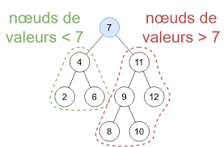
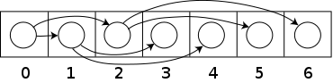

# arbre binaire

En informatique, un arbre binaire est une structure de données qui peut se représenter sous la forme d'une hiérarchie dont 
chaque élément est appelé nœud, le nœud initial étant appelé racine. Dans un arbre binaire, chaque élément possède au plus deux éléments fils au niveau inférieur, 
habituellement appelés gauche et droit. Du point de vue de ces éléments fils, l'élément dont ils sont issus au niveau supérieur est appelé père.

Au niveau le plus élevé, niveau 0, il y a un nœud racine. Au niveau directement inférieur, 
il y a au plus deux nœuds fils. En continuant à descendre aux niveaux inférieurs, on peut en avoir quatre, 
puis huit, seize, etc. c'est-à-dire la suite des puissances de deux. Un nœud n'ayant aucun fils est appelé feuille.

- parlons d'un arbre binaire de recherche qui est un arbre binaire dans lequel chaque nœud possède une clé, telle que chaque nœud du sous arbre gauche ait une clé inférieure ou égale à celle du nœud considéré, et que chaque nœud du sous arbre droit possède une clé supérieure ou égale à celle-ci — selon la mise en œuvre de l'ABR, on pourra interdire ou non des clés de valeur égale. Les nœuds que l'on ajoute deviennent des feuilles de l'arbre.

# un tas binaire
- *Un tas binaire* est un arbre binaire parfait, on peut donc l'implémenter de manière compacte avec un tableau.
	La racine se situe à l'index *0*
	Étant donné un nœud à l'index *i*, son fils gauche est à l'index *2i + 1* et son fils droit à  *2i + 2*
	Étant donné un nœud à l'index *i > 0*, son père est à l'index *[(i-1)/2]* (arrondi à l'entier inférieur).

# *Méthode d'itération des arbres binaires*

Souvent, il est souhaitable de visiter chacun des nœuds dans un arbre et d'y examiner la valeur. Il existe plusieurs ordres dans lesquels les nœuds peuvent être visités, et chacun a des propriétés utiles qui sont exploitées par les algorithmes basés sur les arbres binaires.

- Parcours préfixe: suivant la logique *R,G,D* lors de de l'affichage des données 
- infixe : suivant la logique *G,R,D* lors de de l'affichage des données 
- postfixe : suivant la logique *G,D,R* lors de de l'affichage des données 

N.B: R: étant la racine de l'arbre, G: le noeud gauche de chaque père, D: le noeud droit de chaque père

# Execution
-rasurez-vous que vous avez installer le compilateur *Mingw" dans votre variable d'environnement. si cela ne pas le cas click sur ce lien https://sourceforge.net/projects/mingw/,

-exécuter les programmes dans un IDE de votre choix pour mon cas vscode : https://code.visualstudio.com/download

-si vous avez résolu toutes les dépendances, écrivez cette commande dans le terminal 
qui est intégré par défaut dans vscode : -> *gcc arbre.c -o bon && ./bon* 
vous aurez la possibilité de constuire votre arbre binaire de recherche 
et le programme vous générera automatiquement les différents parcours dans l'arbre
ainsi que la possibilité de faire une recherche.

